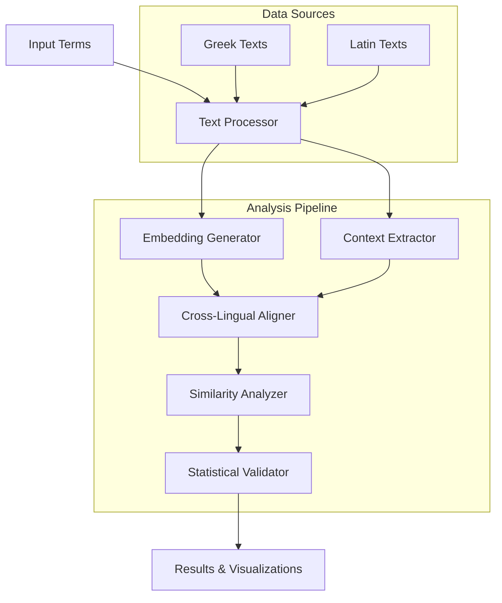

# PhiloBERTA: A Transformer-Based Cross-Lingual Analysis of Greek and Latin Lexicon

[](https://opensource.org/licenses/MIT)
[](https://pytorch.org/)

## Overview

PHILOBERTA is a specialized transformer-based framework designed to analyze and quantify semantic relationships between Ancient Greek and Latin philosophical terms. By leveraging modern language models and classical linguistics, our approach bridges the gap between ancient languages and contemporary NLP techniques.

The project demonstrates remarkable effectiveness in:
- Identifying semantic parallels between etymologically related terms across languages
- Maintaining robust performance despite variations in textual context and genre
- Providing quantitative insights into classical philosophical terminology

## Key Results

Our latest analysis shows:
- **81.4% similarity scores** for etymologically related pairs (±0.3%)
- **78.0% baseline similarity** for control pairs (±2.3%)
- **Statistically significant differentiation** (p = 0.012, t = 3.219)
- **Strong performance** across major philosophical concepts:
  - ἐπιστήμη-scientia: 0.820
  - δικαιοσύνη-iustitia: 0.814
  - ἀλήθεια-veritas: 0.814

## Features

**Core Components**
- Multilingual transformer model trained on classical texts
- Cross-lingual term alignment system
- Statistical significance testing framework

**Analysis Tools**
- Automated term extraction and alignment
- Cross-lingual similarity metrics
- Configurable context window analysis

**Visualization Tools**
- Term relationship networks
- Semantic space projections
- Comparative analysis plots

## System Architecture



## Installation

```bash
git clone https://github.com/rumiallbert/philoberta.git
cd philoberta
pip install -r requirements.txt
```

### Requirements
- Python 3.8+
- PyTorch 2.0+
- Transformers
- CLTK (Classical Language Toolkit)
- scikit-learn
- pandas
- matplotlib
- seaborn

## Usage

```python
from philoberta.model import PHILOBERTA

# Initialize the model
model = PHILOBERTA()  # Uses default bert-base-multilingual-cased

# To analyze terms with context
greek_contexts = ["Context 1 with ψυχή", "Context 2 with ψυχή"]
latin_contexts = ["Context 1 with anima", "Context 2 with anima"]

similarity = model.cross_similarity(
    greek_term="ψυχή",
    latin_term="anima",
    greek_contexts=greek_contexts,
    latin_contexts=latin_contexts
)

# Generate visualizations
model.plot_similarity_distribution(similarity)
```

## Citation

```bibtex
@misc{allbert2025philobertatransformerbasedcrosslingualanalysis,
      title={PhiloBERTA: A Transformer-Based Cross-Lingual Analysis of Greek and Latin Lexicons}, 
      author={Rumi A. Allbert and Makai L. Allbert},
      year={2025},
      eprint={2503.05265},
      archivePrefix={arXiv},
      primaryClass={cs.CL},
      url={https://arxiv.org/abs/2503.05265}, 
}
```

## License

This project is licensed under the MIT License - see the [LICENSE](LICENSE) file for details.
